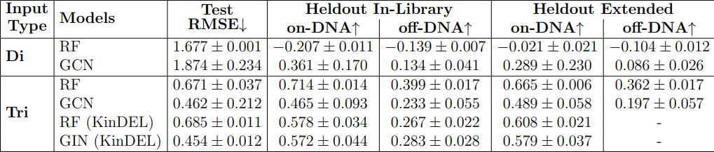
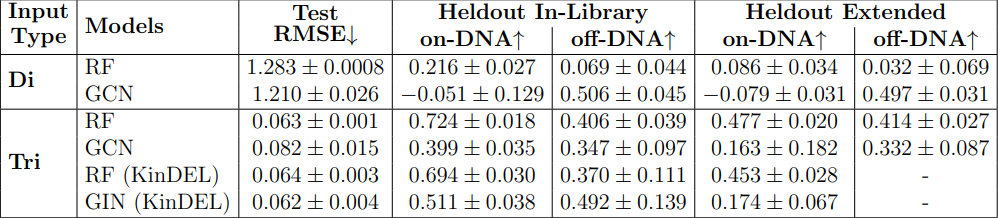
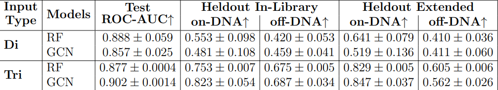
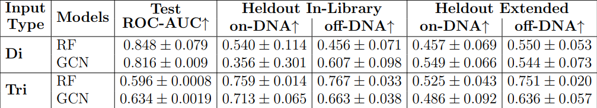
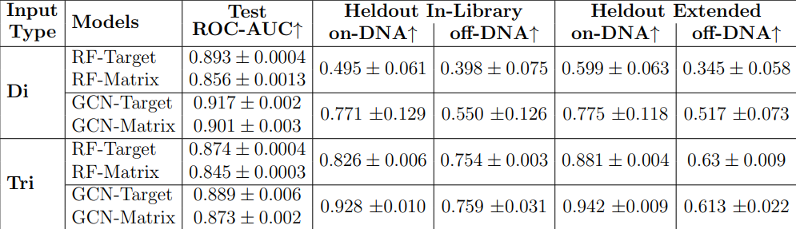
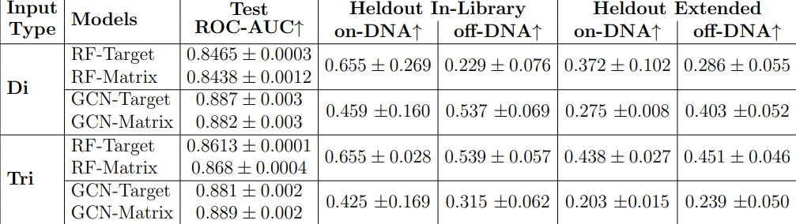

# Deepchem-DEL

Deepchem-DEL is an open-source platform for reproducible and scalable machine learning on DNA-encoded libraries (DELs). It provides a configurable denoising pipeline and modular DeepChem workflows for hit prediction, enrichment analysis, and benchmarking.

Deepchem-DEL is built on top of DeepChem-Server, a minimal cloud infrastructure for DeepChem. This foundation allows Deepchem-DEL to run scalable ML workflows in the cloud, manage experiments efficiently, and provide reproducible results with minimal setup. By leveraging DeepChem-Server, users can focus on DEL modeling and benchmarking without worrying about the underlying computational infrastructure.

Benchmarked on the KinDEL dataset, Deepchem-DEL reproduces key baselines across diverse models, enabling streamlined DEL modeling with minimal engineering overhead.

## Table of Contents
- [Installation](#installation)
- [Project structure](#project-structure)
- [Datasets](#datasets)
- [Denoising and Task Setup](#denoising-and-task-setup)
- [Quick Start](#quick-start)
- [Held-out analysis](#held-out-analysis)
- [Citations](#citations)

---

## Installation

### Create Local Python environment

Install pyds on local python environment

### Run the service with Docker (recommended for server)
```bash
# From repo root
cd deepchem_server
./docker.sh
```
The API will be available at `http://localhost:8000` with interactive docs at `http://localhost:8000/docs`.

---

## Project structure
```text
├── deepchem-del/                    # Benchmarking + high-level client pipeline over the server
   ├── benchmark/
   │   ├── configs/                 # Example benchmark configs (yaml/json)
   │   ├── *                        # Benchmark entrypoints for unified and non-unified disynthons and trisynthons
   │   └── ...
   ├── utils/
   │   ├── pipeline.py              # Featurize → split → train → evaluate → infer pipeline client
   │   ├── denoise_utils.py
   │   └── logging_utils.py
   └── tests/
```

---

## Datasets

We utilized the [KinDEL](https://arxiv.org/abs/2410.08938) dataset, a publicly available DNA-encoded library (DEL) resource comprising over 80 million small molecules screened against two kinase targets, MAPK14 and DDR1. For our experiments, we selected the 1 million compound subset recommended by KinDEL, which strikes a balance between chemical diversity and computational tractability.

Each target in the KinDEL dataset is accompanied by two sequence count measures:
SEQ target (target) and SEQ matrix (control), with three independent experimental repli-
cates available for both. By default, molecular structures are provided in Trisynthon SMILES
format, along with the corresponding constituent synthons. Across all three synthon posi-
tions, we identified 1,641 unique synthons in the MAPK14 dataset and 1,660 unique synthons
in the DDR1 dataset.

---

## Denoising and Task Setup

Our experimental design follows two sequential denoising choices:

1. Amplified (disynthon) v/s Non-amplified (tri-synthon). In the non-amplified
baseline, compounds are represented as raw tri-synthons with sequencing counts taken di-
rectly from selection experiments. In the amplified setting, tri-synthons are collapsed into
disynthons, which aggregates counts from multiple tri-synthons into fewer structures. The
detailed experimental pipelines for tri-synthons and disynthons are shown in the figure below.

2. Unified v/s Non-unified. For both amplified and non-amplified data, we compared
non-unified models, trained separately for each target and its control, against unified models,
trained jointly across targets. Unified models were implemented as either classification (hit
vs. non-hit) or regression (predicting enrichment values).
The classification task was constructed by binning molecules such that the molecules
with respective enrichment scores in top 10% were labeled as hits (1) and the remainder as
non-hits (0). The 10 percentile choice here can be considered as a sensitivity setting for the
classification task.

*Fig1: Overview of experimental design. Left: trisynthon-based pipeline using raw
compound representations and direct sequencing counts. Right: disynthon-based pipeline
with amplified sequencing counts obtained by collapsing trisynthons into disynthons. Both
pipelines proceed through unified/non-unified denoising strategies and are evaluated on held-
out KinDEL datasets.*


---

## Quick Start

### 1. Configuration Structure

Deepchem-DEL uses YAML configuration files to define complete ML workflows. Each config specifies the denoising pipeline, featurization, model training, evaluation, and inference parameters. For example, the unified trisynthon regression configuration (`uni_tri_reg_config.yaml`) includes: `denoise_config` for data preprocessing with control/target sequence columns and aggregation operations, `featurizer_config` for molecular featurization (e.g., ECFP fingerprints), `split_config` for train/validation/test splits, `train_config` for model specification (e.g., Random Forest regressor), `evaluate_config` for performance metrics, and `infer_config` for prediction settings. This modular approach enables reproducible experiments across different denoising strategies, model types, and target tasks.

### 2. Benchmark

Benchmark scripts live in `deepchem-del/benchmark/` and are configured via YAML files in `deepchem-del/benchmark/configs/`.

Run a unified disynthon classification benchmark (example):
```bash
python deepchem-del/benchmark/unified_disynthon_classification.py \
  --config deepchem-del/benchmark/configs/uni_di_class_config.yaml
```

Inspect and modify these configs to point to your datasets and adjust model/training parameters.

---

## Held-out analysis

All trained models were evaluated on held-out KinDEL data, including both on-DNA (in-library and extended) and off-DNA (in-library and extended) test sets. For classification models, compounds in the held-out set were labeled as hits if their Kd values were within the lowest 10%, and as non-hits otherwise. In the case of non-unified classification models, target and control predictions were integrated using a Target AND NOT Control scheme.


*Fig2: Performance of unified regression models for amplified (di) and non-amplified (tri) on the DDR1 kinase target under random split evaluation. Models were trained jointly across
targets to predict enrichment values. Results are reported as test RMSE (lower is better) and negative Pearson correlation for held-out in-library and held-out extended library sets.*

*Fig3: Performance of unified regression models for amplified (di) and non-amplified (tri) on the MAPK14 kinase target under random split evaluation. Models were trained jointly across targets to predict enrichment values. Results are reported as test RMSE (lower is better) and negative Pearson correlation for held-out in-library and held-out extended library
sets.*

*Fig4:  Performance of unified classification models for amplified (di) and non-amplified
(tri) on the DDR1 target under random split evaluation. Models were trained jointly across
targets, with molecules binned into hits (top 10% enrichment scores) and non-hits (remaining
90%). Results are reported as ROC–AUC scores (higher is better) for the test set, held-out
in-library set, and held-out extended library set.*


*Fig5: Performance of unified classification models for amplified (di) and non-amplified
(tri) on the MAPK14 target under random split evaluation. Models were trained jointly
across targets, with molecules binned into hits (top 10% enrichment scores) and non-hits
(remaining 90%). Results are reported as ROC–AUC scores (higher is better) for the test
set, held-out in-library set, and held-out extended library set.*


*Performance of non-unified classification models for amplified (di) and non-amplified
(tri) on the DDR1 target under random split evaluation. Models were trained separately for
the target and its control, with molecules binned into hits (top 10% enrichment scores) and
non-hits (remaining 90%). Results are reported as ROC–AUC scores (higher is better) for
the test set, held-out in-library set, and held-out extended library set.*


*Performance of non-unified classification models for amplified (di) and non-amplified
(tri) on the MAPK14 target under random split evaluation. Models were trained separately
for the target and its control, with molecules binned into hits (top 10% enrichment scores)
and non-hits (remaining 90%). Results are reported as ROC–AUC scores (higher is better)
for the test set, held-out in-library set, and held-out extended library set.*

---

## Citations

